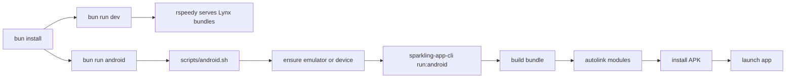

# Runner

Sparkling app [TikTok Lynx stack].

## Stack

- `bun` [package manager and runner]
- `Sparkling` [Android app shell + bridge]
- `Lynx` / `ReactLynx` [UI runtime]
- `rspeedy` [local dev server]
- `Vitest` [unit tests]
- `@lynx-js/react/testing-library` [Lynx test utils]
- `oxlint` and `oxfmt` [lint and format]
- `husky` and `lint-staged` [git hooks]

## Flow



## Quick Start

```bash
bun install
bun run android
```

`bun run android` starts emulator if needed, then builds, autolinks, copies assets, installs, and launches the Android app.

## Android Tools

```bash
bun run adb:devices
```

Show connected devices.

```bash
bun run avd:list
```

List emulators.

```bash
ANDROID_AVD="<name>" bun run avd:start
```

Start a specific emulator.

## Dev Server

```bash
bun run dev
```

Starts `rspeedy` and serves Lynx bundle URLs. Use when you want hot reload without installing APK each time.

## Build

```bash
bun run build
```

Builds bundles and copies assets into `android/app/src/main/assets`.

## Tests

```bash
bun run test
```

Run unit tests.

```bash
bun run test:watch
```

Watch mode.

## Lint + Format

```bash
bun run lint
```

Lint project.

```bash
bun run lint:fix
```

Fix lint issues.

```bash
bun run fmt
```

Format project.

```bash
bun run fmt:check
```

Check formatting.

## Env Check

```bash
bun run doctor
```

Checks Sparkling env.

## Notes

- Android SDK path comes from `ANDROID_HOME`, defaulting to `~/Library/Android/sdk`.
- `JAVA_HOME` falls back to JDK 17.
- `bun run android` is the main day-to-day command.
- `bun run dev` does not render UI by itself. It only serves bundles.
