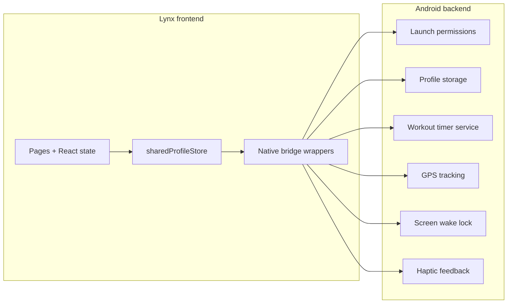

# Runner

Beginner-friendly running app that meets you where you are, adapting to how often you use it. Follows the approach of: don't increase intensity by more than 10%.
The application follow simple logic:

1. Five minute warm-up walk
2. Walk/run interval for 20 minutes
3. Five minute cool-down walk

The intervals change dynamically based on how often you complete a full seven-day period with three workouts. Complete three, and intensity increase by 10%. Don't complete three, and you stay the same. If you're unable to complete a workout period, then intensity decreases automatically.

The goal is that every exercise is successful, creating healthy habits, and eventually get you to the goal of running for the full 20 minutes.

This is not a Couch to 5k program with huge intensity bursts. This is a gradual, gentle program for long-term success.

## Agentic Development

This project is set up for agentic development with [pi](https://pi.dev/). Project skills live in `.agents/skills/`, prompt templates in `.pi/prompts/`, and the Lynx Docs MCP server is configured in `.mcp.json`.

`AGENTS.md` is the entry point for all agents. It describes the repo, how to use the Lynx Docs MCP, and the verification commands.

### Doc Sync

`scripts/verify-docs.ts` checks that `AGENTS.md` mentions every skill in `.agents/skills/` and every prompt template in `.pi/prompts/`. Run it after any substantial change.

```bash
bun run verify-docs
```

## Architecture

The Lynx pages own UI state and user interaction. Android owns long-lived app state, permissions, and native capabilities.



### State ownership

- **Frontend**: React state drives page UI, with `sharedProfileStore` keeping the in-memory profile snapshot.
- **Bridge layer**: `src/pages/*/index.tsx` wires `NativeModules` into the Lynx bridge wrappers.
- **Android backend**: Android handles launch permissions, profile storage, workout timing, GPS tracking, screen wake lock, and haptic feedback.

## macOS Install

Install the Android pieces with Homebrew:

```bash
brew install --cask android-studio
brew install openjdk@17
```

Add this to `~/.zshrc`:

```bash
export JAVA_HOME="$(brew --prefix openjdk@17)/libexec/openjdk.jdk/Contents/Home"
export PATH="$JAVA_HOME/bin:$PATH"
export ANDROID_HOME="$HOME/Library/Android/sdk"
export ANDROID_SDK_ROOT="$ANDROID_HOME"
export PATH="$ANDROID_HOME/platform-tools:$ANDROID_HOME/emulator:$PATH"
```

In Android Studio's SDK Manager, install the Android 15 platform, Build Tools 35.0.0, and NDK 27.x or newer.

- `bun`
- `npm install -g typescript typescript-language-server` — required for LSP code intelligence (pi-lens auto-discovers it from PATH)
- Android Studio, with Android SDK, platform-tools, and emulator

## Stack

- `bun` [package manager and runner]
- `Sparkling` [Android app shell + bridge]
- `Lynx` / `ReactLynx` [UI runtime]
- `rspeedy` [local dev server]
- `Vitest` [unit tests]
- `@lynx-js/react/testing-library` [Lynx test utils]
- `oxlint` and `oxfmt` [lint and format]
- `husky` and `lint-staged` [git hooks]

## Flow

`bun dev`

- ensures the android emulator is running
- runs rebuild + reinstall loop
- watches `src`, `app.config.ts`, and `lynx.config.ts`

`bun run smoke`

- one-shot build
- installs and launches Android app

`bun run clean`

- removes generated build output
- clears Android build caches

`bun run log`

- tails Android logcat

`bun run log:app`

- tails only app process logs
- app must be running first

## Quick Start

```bash
bun install
bun dev
```

`bun dev` is the main day-to-day command.

## Logs

```bash
bun log:app
```

Watch Android logs while the device is plugged into the machine.

## Dev Loop

```bash
bun dev
```

Starts the Android rebuild + reinstall loop.

## Build

```bash
bun build
```

Builds bundles and copies assets into `android/app/src/main/assets`.

## Tests

```bash
bun run test
```

Runs unit tests once.

```bash
bun run typecheck
```

Runs TypeScript typecheck only.

## Lint + Format

```bash
bun lint
```

Runs lint checks.

```bash
bun lint:fix
```

Auto-fixes lint issues.

```bash
bun fmt:check
```

Checks formatting.

```bash
bun fmt
```

Formats project.

## Notes

- Android SDK path comes from `ANDROID_HOME`, defaulting to `~/Library/Android/sdk`.
- `JAVA_HOME` should point at the Homebrew `openjdk@17` install path shown above.
- `adb` and emulator commands need Android SDK paths in `~/.zshrc`.
- `bun dev` is the main day-to-day command.
